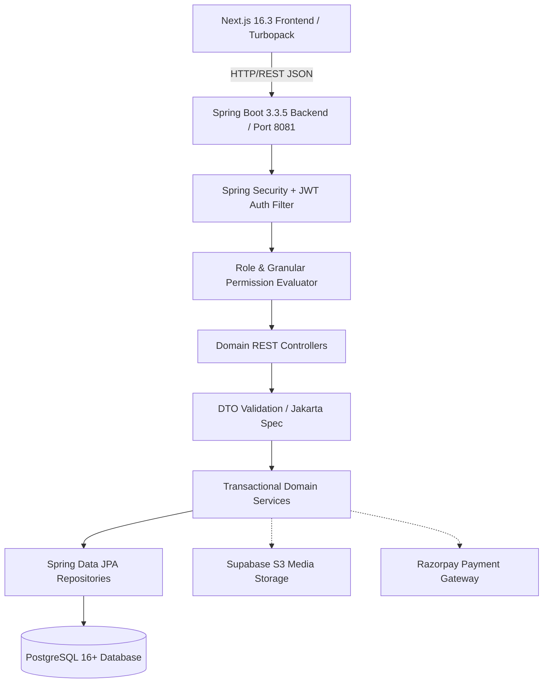
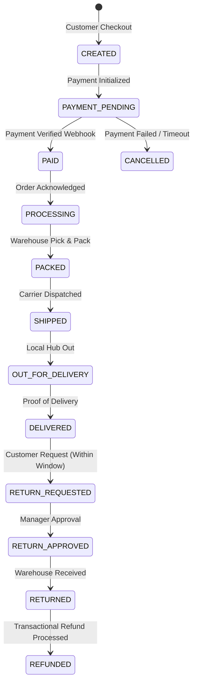
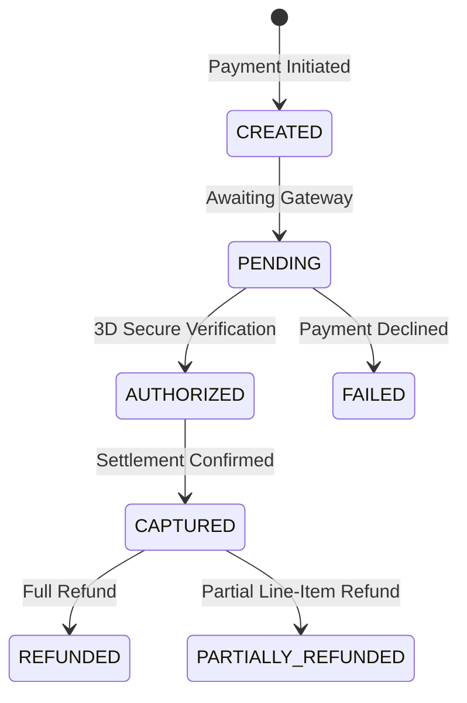

# PROVANA — Master System Architecture Specification

This document serves as the single source of architectural truth for the PROVANA e-commerce platform.

---

## 1. System Topology & Architecture Overview

PROVANA is engineered as a high-performance **Modular Monolith** with strict domain boundaries, separating customer presentation, business rules, transactional persistence, content management, and AI intelligence.



### Core Architecture Axioms
1. **CMS Controls Content — Application Code Controls Behavior**: Content layouts, marketing copy, and storytelling are CMS-driven; pricing, inventory, security, and state transitions are strictly governed by backend code.
2. **Backend is the Final Authority**: Frontend RBAC exists solely for UX enhancement. Security and data integrity are enforced server-side.
3. **Stateless Authentication**: Cryptographically signed HMAC-SHA256 JWTs convey verified identities and roles.

---

## 2. Frontend Architecture (Next.js 16 + React 19 + TypeScript)

```
frontend/
├── src/
│   ├── app/                    # Next.js App Router (pages & server/client boundaries)
│   │   ├── admin/              # Staff & Administrator portal
│   │   ├── products/           # Customer catalogue (PLP, PDP, filtering)
│   │   ├── layout.tsx          # Root HTML layout with providers
│   │   └── page.tsx            # High-conversion athlete storefront
│   ├── components/             # Reusable UI component library (atomic design)
│   ├── context/                # Context providers (AuthContext, StoreContext)
│   ├── lib/
│   │   ├── api/                # Centralized API client layer
│   │   └── permissions.ts      # Permission dictionary & can() UX evaluator
│   ├── types/                  # Domain TypeScript definitions & contracts
│   └── styles/                 # Tailwind / CSS module styling
```

### Frontend Data Access Pattern
- Components consume typed domain APIs (`productApi`, `adminProductApi`, `authApi`, `categoryApi`, `userApi`) which wrap the core `apiRequest<T>` client.
- `apiRequest` manages base URLs, timeout handling, automatic JWT Bearer token attachment, unified error unboxing (`ApiError`), and clean 401/403 recovery.

---

## 3. Backend Architecture (Modular Monolith)

PROVANA organizes backend logic around business domains within `com.provana`:

| Module Package | Responsibility |
| :--- | :--- |
| `com.provana.auth` | JWT issuance, verification, security context, password hashing, and role permission definitions. |
| `com.provana.user` | User persistence, profile management, and administrative user/role operations. |
| `com.provana.catalog` | Products, Categories, Subcategories, Brands, Variants, SKUs, Media, Nutrition, and FAQs. |
| `com.provana.inventory` | Stock adjustments, available/reserved levels, concurrency control, and low-stock alerts. |
| `com.provana.cart` | Customer shopping carts, SKU validation, price calculation, and server-side cart persistence. |
| `com.provana.checkout` | Checkout orchestrator, order drafting, tax & discount calculation. |
| `com.provana.payment` | Stateful payment lifecycle, transaction logging, Razorpay integration, and webhook verification. |
| `com.provana.order` | Order state machine, lifecycle transitions, invoice generation, and customer ownership. |
| `com.provana.shipping` | Carrier dispatch abstraction, tracking number binding, and delivery status updates. |
| `com.provana.refund` | Return requests, approval workflows, and transactional refund processing. |
| `com.provana.cms` | Editorial content, banners, hero sections, blogs, and marketing publishing workflows. |
| `com.provana.ai` | Natural language product assistant, semantic recommendation, and catalogue insights. |
| `com.provana.common` | Global exception handling, standardized `ApiResponse<T>`, audit entities, and pagination. |

---

## 4. Database Architecture & Migrations (PostgreSQL + Flyway)

All schema changes are versioned via Flyway migrations in `src/main/resources/db/migration`:

- `V1__initial_schema_foundation.sql`: Extensions (`uuid-ossp`, `pgcrypto`) and `system_settings`.
- `V2__catalogue_schema.sql`: Core catalogue tables with foreign keys, composite indexes, and audit fields (`categories`, `subcategories`, `brands`, `products`, `product_variants`, `skus`, `product_media`, `product_nutrition`, `product_faqs`).
- `V3__seed_catalogue_data.sql`: Seed data for categories, subcategories, brands, and reference products.
- `V4__user_auth_schema.sql`: `users` table with email uniqueness, role indexing, and initial administrative seeds.

---

## 5. Security & RBAC Architecture

### The 6 Business Roles

1. **`ADMIN`**: Platform master administrator (User management, RBAC, System Settings, Audit Logs, Catalogue, Orders, Inventory, Marketing, Global Analytics).
2. **`MANAGER`**: Store Operations lead (Inventory adjustments, order processing, shipments, customer returns, operational reports). *No catalogue write, no users, no system settings.*
3. **`PRODUCT_MANAGER`**: Catalogue owner (Products, categories, brands, variants, SKUs, media, nutrition, FAQs, catalogue reports). *No users, no order writes, no system settings.*
4. **`CONTENT_MANAGER`**: CMS & editorial editor (Hero banners, landing pages, blogs, media library, SEO content, content reports).
5. **`ORDER_MANAGER`**: Order fulfilment specialist (Order processing, status workflows, shipment tracking, returns/refund processing).
6. **`CUSTOMER`**: Storefront athlete (Browse catalogue, add to cart/wishlist, place orders, view own orders/refunds, submit reviews).

### Data Ownership & IDOR Protection
- Resource access checks verify `ownerId == currentUserId || isElevatedAdmin`.
- Cross-customer access to `/api/v1/orders/{id}` returns `403 Forbidden`.

---

## 6. Commerce Workflows & State Machines

### 6.1 Order Lifecycle State Machine


### 6.2 Payment State Machine


---

## 7. AI & Intelligent Assistance Architecture

- **RAG & Vector Grounding**: AI features query authoritative, real-time database records before synthesizing responses.
- **Deterministic Bounds**: AI is forbidden from fabricating prices, stock quantities, order statuses, or official policies.

---

## 8. Environment & Configuration Security

- All secrets (JWT Secret, Database Credentials, Supabase keys, Razorpay secrets) are configured strictly via environment variables.
- Standard ports: Frontend on `3000`, Backend on `8081`, Database on `5432`.
