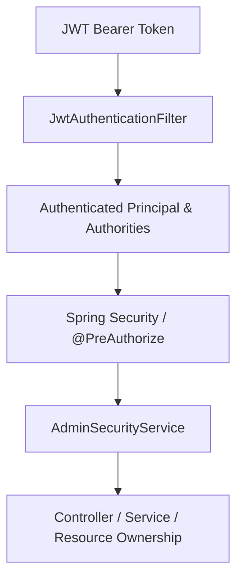

# PROVANA Enterprise RBAC & Access Control Specification

This document provides the definitive specification for Role-Based Access Control (RBAC) across the PROVANA sports nutrition e-commerce platform.

---

## 1. Objective & Architecture

PROVANA enforces a multi-tier, defense-in-depth security model where **the Backend is ALWAYS the final authority**. Frontend visibility restrictions are strictly for user experience (UX) and never relied upon for security.



### Core Hierarchy
$$\text{ROLE} \longrightarrow \text{PERMISSIONS} \longrightarrow \text{MODULE ACCESS} \longrightarrow \text{API ENDPOINT} \longrightarrow \text{FRONTEND UI ACCESS}$$

---

## 2. Business Roles & Responsibilities

| Role | Domain / Purpose | Key Responsibilities | Forbidden Boundaries |
| :--- | :--- | :--- | :--- |
| **`ADMIN`** | Platform Master Administrator | User management, RBAC, system settings, audit logs, catalogue, orders, inventory, marketing, global analytics. | None (Master privilege) |
| **`MANAGER`** | Store Operations Lead | Inventory stock adjustments, order operations, shipments, customer returns, operational reports. | Catalogue write/delete, users, roles, system settings, CMS. |
| **`PRODUCT_MANAGER`** | Catalogue Owner | Products, categories, subcategories, brands, variants, SKUs, media, nutrition specs, FAQs, catalogue reports. | User management, RBAC, orders, payments, store-wide inventory adjustments, system settings. |
| **`CONTENT_MANAGER`** | CMS & Editorial Editor | Hero banners, landing pages, blogs, editorial storytelling, media library, SEO content, content reports. | Catalogue write, orders, payments, inventory, users, system settings. |
| **`ORDER_MANAGER`** | Order & Fulfilment Specialist | Order search/processing, status workflows, shipment tracking, carrier dispatch, returns/refund processing. | Catalogue management, CMS, users, roles, system settings. |
| **`CUSTOMER`** | Storefront Athlete | Browse catalogue, add to cart/wishlist, place orders, view own orders/refunds, submit reviews. | All administrative and staff APIs; other customer data. |

---

## 3. Granular Permission Catalog

### 3.1 Catalogue & Commerce
- `CATALOGUE_READ`, `CATALOGUE_WRITE`, `CATALOGUE_CREATE`, `CATALOGUE_UPDATE`, `CATALOGUE_DELETE`, `CATALOGUE_PUBLISH`, `CATALOGUE_MEDIA_MANAGE`
- `CATEGORY_READ`, `CATEGORY_CREATE`, `CATEGORY_UPDATE`, `CATEGORY_DELETE`
- `SUBCATEGORY_READ`, `SUBCATEGORY_CREATE`, `SUBCATEGORY_UPDATE`, `SUBCATEGORY_DELETE`
- `BRAND_READ`, `BRAND_CREATE`, `BRAND_UPDATE`, `BRAND_DELETE`
- `PRODUCT_READ`, `PRODUCT_CREATE`, `PRODUCT_UPDATE`, `PRODUCT_DELETE`, `PRODUCT_PUBLISH`
- `PRODUCT_VARIANT_READ`, `PRODUCT_VARIANT_CREATE`, `PRODUCT_VARIANT_UPDATE`, `PRODUCT_VARIANT_DELETE`
- `SKU_READ`, `SKU_CREATE`, `SKU_UPDATE`, `SKU_DELETE`
- `PRODUCT_MEDIA_READ`, `PRODUCT_MEDIA_CREATE`, `PRODUCT_MEDIA_UPDATE`, `PRODUCT_MEDIA_DELETE`
- `PRODUCT_NUTRITION_READ`, `PRODUCT_NUTRITION_WRITE`
- `PRODUCT_FAQ_READ`, `PRODUCT_FAQ_WRITE`

### 3.2 Inventory & Store Operations
- `INVENTORY_READ`, `INVENTORY_WRITE`, `INVENTORY_ADJUST`, `INVENTORY_TRANSFER`, `INVENTORY_REPORT_READ`

### 3.3 Orders, Shipments, Returns & Refunds
- `ORDER_MANAGE`, `ORDER_READ`, `ORDER_CREATE`, `ORDER_UPDATE`, `ORDER_STATUS_UPDATE`, `ORDER_CANCEL`, `ORDER_FULFILL`, `ORDER_REPORT_READ`
- `PAYMENT_READ`, `PAYMENT_VERIFY`, `PAYMENT_REFUND`
- `SHIPMENT_READ`, `SHIPMENT_CREATE`, `SHIPMENT_UPDATE`, `SHIPMENT_TRACK`, `SHIPMENT_FULFILL`
- `RETURN_READ`, `RETURN_APPROVE`, `RETURN_REJECT`, `RETURN_PROCESS`
- `REFUND_READ`, `REFUND_CREATE`, `REFUND_APPROVE`, `REFUND_PROCESS`

### 3.4 Customer Management & Support
- `CUSTOMER_READ`, `CUSTOMER_UPDATE`, `CUSTOMER_SUPPORT`

### 3.5 User & RBAC Management (ADMIN Only)
- `USER_MANAGE`, `USER_READ`, `USER_CREATE`, `USER_UPDATE`, `USER_DELETE`
- `ROLE_READ`, `ROLE_CREATE`, `ROLE_UPDATE`, `ROLE_DELETE`
- `PERMISSION_READ`, `PERMISSION_ASSIGN`, `PERMISSION_REVOKE`, `RBAC_MANAGE`

### 3.6 CMS & Media
- `CMS_READ`, `CMS_CREATE`, `CMS_UPDATE`, `CMS_DELETE`, `CMS_REVIEW`, `CMS_APPROVE`, `CMS_PUBLISH`, `CMS_SCHEDULE`
- `MEDIA_READ`, `MEDIA_UPLOAD`, `MEDIA_UPDATE`, `MEDIA_DELETE`

### 3.7 Marketing & Discounts
- `COUPON_READ`, `COUPON_CREATE`, `COUPON_UPDATE`, `COUPON_DELETE`
- `DISCOUNT_READ`, `DISCOUNT_CREATE`, `DISCOUNT_UPDATE`, `DISCOUNT_DELETE`
- `CAMPAIGN_READ`, `CAMPAIGN_CREATE`, `CAMPAIGN_UPDATE`, `CAMPAIGN_DELETE`, `CAMPAIGN_PUBLISH`

### 3.8 Reviews Moderation
- `REVIEW_READ`, `REVIEW_CREATE`, `REVIEW_MODERATE`, `REVIEW_APPROVE`, `REVIEW_REJECT`, `REVIEW_DELETE`

### 3.9 Reports & Analytics
- `REPORT_READ`, `REPORT_EXPORT`, `REPORT_OPERATIONAL_READ`, `REPORT_CATALOGUE_READ`, `REPORT_ORDER_READ`, `REPORT_CONTENT_READ`
- `ANALYTICS_READ`, `ANALYTICS_EXPORT`

### 3.10 AI Tools & Insights
- `AI_ASSISTANT_USE`, `AI_PRODUCT_RECOMMENDATION`, `AI_CATALOGUE_INSIGHTS`, `AI_ORDER_INSIGHTS`, `AI_CONTENT_GENERATE`, `AI_ADMIN_INSIGHTS`

### 3.11 System Settings & Audit Logs
- `SYSTEM_SETTINGS_READ`, `SYSTEM_SETTINGS_UPDATE`, `AUDIT_LOG_READ`

---

## 4. Role $\rightarrow$ Permission Matrix

| Module Domain | `ADMIN` | `PRODUCT_MANAGER` | `MANAGER` | `CONTENT_MANAGER` | `ORDER_MANAGER` | `CUSTOMER` |
| :--- | :---: | :---: | :---: | :---: | :---: | :---: |
| **Catalogue / Products** | Read / Write / Delete | Read / Write / Delete | Read Only | ❌ | ❌ | Read (Storefront) |
| **Categories & Brands** | Read / Write / Delete | Read / Write / Delete | Read Only | ❌ | ❌ | Read Only |
| **Variants & SKUs** | Read / Write / Delete | Read / Write / Delete | Read Only | ❌ | ❌ | Read Only |
| **Inventory Operations** | Read / Write / Adjust | ❌ | Read / Write / Adjust | ❌ | ❌ | ❌ |
| **Orders & Fulfilment** | Full Access | ❌ | Ops & Fulfilment | ❌ | Ops & Fulfilment | Own Orders Only |
| **Shipments & Tracking** | Full Access | ❌ | Full Access | ❌ | Full Access | Own Shipments |
| **Returns & Refunds** | Full Access | ❌ | Operational Process | ❌ | Operational Process | Own Return Requests |
| **CMS & Landing Pages** | Full Access | ❌ | ❌ | Read / Write / Publish | ❌ | Read Only (Public) |
| **Media Library** | Full Access | Catalogue Media | ❌ | Content Media | ❌ | ❌ |
| **Marketing / Coupons** | Full Access | ❌ | ❌ | ❌ | ❌ | Apply at Checkout |
| **User & Role Admin** | Full Access | ❌ | ❌ | ❌ | ❌ | ❌ |
| **System Settings** | Full Access | ❌ | ❌ | ❌ | ❌ | ❌ |
| **Audit Logs** | Full Access | ❌ | ❌ | ❌ | ❌ | ❌ |

---

## 5. Protected Endpoint Security Rules

| HTTP Method | Endpoint Path | Required Authority / Permission | Allowed Roles |
| :--- | :--- | :--- | :--- |
| `POST` | `/api/v1/admin/products` | `PRODUCT_CREATE` | `ADMIN`, `PRODUCT_MANAGER` |
| `PUT` | `/api/v1/admin/products/{id}` | `PRODUCT_UPDATE` | `ADMIN`, `PRODUCT_MANAGER` |
| `PATCH` | `/api/v1/admin/products/{id}/status` | `PRODUCT_UPDATE` | `ADMIN`, `PRODUCT_MANAGER` |
| `DELETE` | `/api/v1/admin/products/{id}` | `PRODUCT_DELETE` | `ADMIN`, `PRODUCT_MANAGER` |
| `POST` | `/api/v1/admin/categories` | `CATEGORY_CREATE` | `ADMIN`, `PRODUCT_MANAGER` |
| `PUT` | `/api/v1/admin/categories/{id}` | `CATEGORY_UPDATE` | `ADMIN`, `PRODUCT_MANAGER` |
| `DELETE` | `/api/v1/admin/categories/{id}` | `CATEGORY_DELETE` | `ADMIN`, `PRODUCT_MANAGER` |
| `POST` | `/api/v1/admin/inventory/adjust` | `INVENTORY_ADJUST` | `ADMIN`, `MANAGER` |
| `PATCH` | `/api/v1/admin/orders/{id}/status` | `ORDER_STATUS_UPDATE` | `ADMIN`, `MANAGER`, `ORDER_MANAGER` |
| `POST` | `/api/v1/admin/shipments/{id}/fulfill` | `SHIPMENT_FULFILL` | `ADMIN`, `MANAGER`, `ORDER_MANAGER` |
| `GET` | `/api/v1/admin/users` | `USER_READ` | `ADMIN` Only |
| `PUT` | `/api/v1/admin/users/{id}/role` | `ROLE_UPDATE` | `ADMIN` Only |
| `DELETE` | `/api/v1/admin/users/{id}` | `USER_DELETE` | `ADMIN` Only |
| `POST` | `/api/v1/admin/cms/pages` | `CMS_CREATE` | `ADMIN`, `CONTENT_MANAGER` |
| `PUT` | `/api/v1/admin/settings` | `SYSTEM_SETTINGS_UPDATE` | `ADMIN` Only |
| `GET` | `/api/v1/admin/audit-logs` | `AUDIT_LOG_READ` | `ADMIN` Only |

---

## 6. Frontend Permission System

The frontend exposes clean, centralized helper functions in `src/lib/permissions.ts` and through the `useAuth()` React hook.

```tsx
import { useAuth } from "@/context/AuthContext";

export function ProductActions({ product }) {
  const { can } = useAuth();

  return (
    <div>
      {can("PRODUCT_UPDATE") && <button>✏️ Edit Product</button>}
      {can("PRODUCT_DELETE") && <button>🗑️ Delete Product</button>}
      {can("INVENTORY_ADJUST") && <button>📊 Adjust Stock</button>}
    </div>
  );
}
```

---

## 7. Data Ownership Rules

- **Customer Orders & Accounts**: Customers can query `/api/v1/orders/{id}` only when `order.userId == principal.id`. Cross-user access returns `403 Forbidden`.
- **Admin Bypass**: Users with the `ADMIN` role are authorized to inspect orders and customer records for auditing and support.

---

## 8. Critical Security Policies

1. **No Client Header Trust**: Headers such as `X-Admin-Role`, `X-Role`, or `X-Permission` are strictly disregarded.
2. **Stateless JWT Authority**: All permissions are parsed directly from the verified cryptographic JWT signature and user entity.
3. **Privilege Escalation Prevention**: Role mutation endpoints require `ROLE_UPDATE` (Admin-only). Users cannot elevate their own roles or assign roles higher than their permissions.

---

## 9. Testing & Verification

- Comprehensive RBAC unit and integration tests are codified in `RbacMatrixIntegrationTest.java`.
- Validated via `./mvnw clean test` (Backend) and `npm run build` (Frontend).
